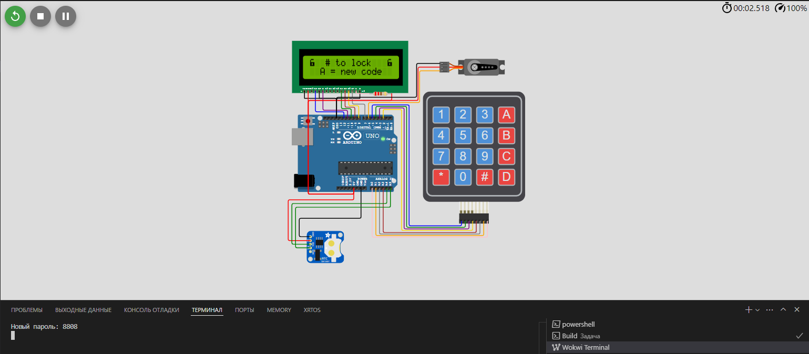
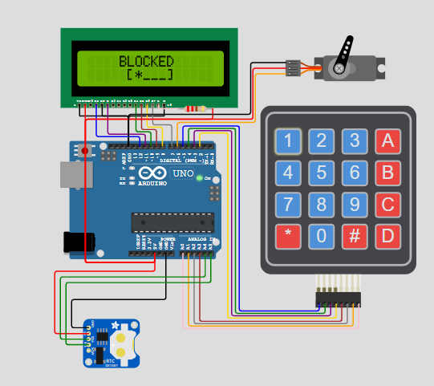
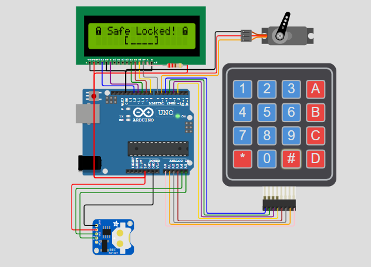

# Курсовая работа по Микропроцессорным системам
Тема курсовой работы: **Кодовый замок**

Выполнил: **Христокьян М.Я.**

## Демо

Установка пароля

Блокировка замка

Блокировка при вводе неправильного пароля 3 раза

